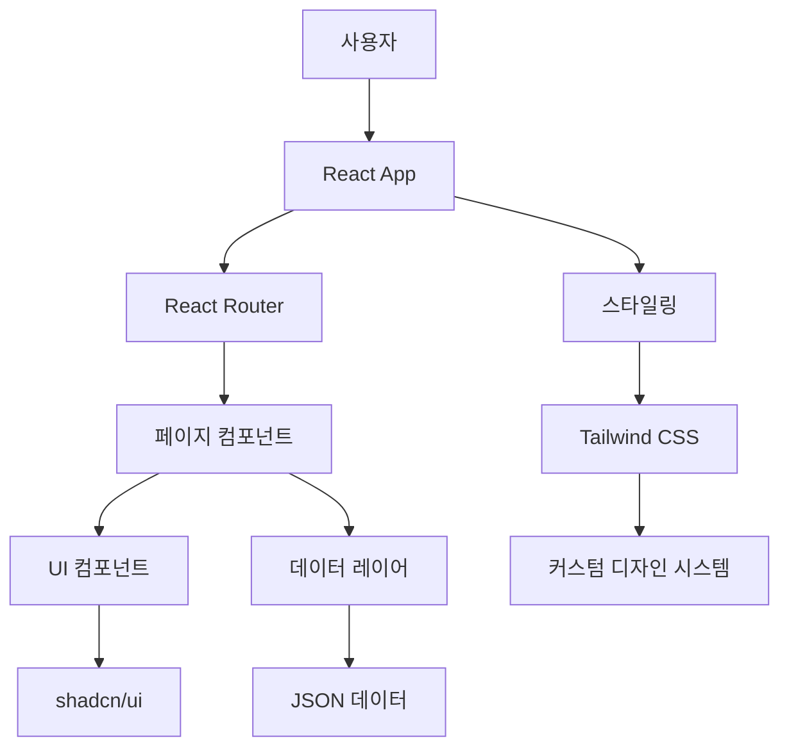
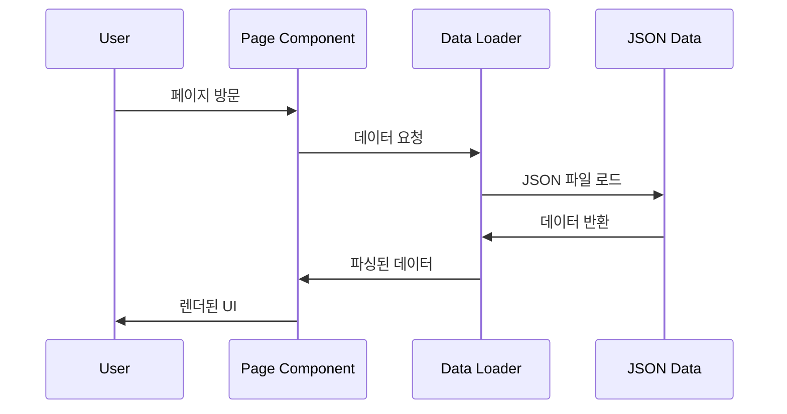

# 아키텍처 문서

## 전체 아키텍처

Domain AX 웹사이트는 SPA(Single Page Application) 아키텍처를 기반으로 구축되었습니다.



## 컴포넌트 구조

### 1. 페이지 컴포넌트
- `Index.tsx`: 메인 홈페이지
- `Levels.tsx`: 레벨 안내 페이지
- `TransitionPlan.tsx`: 전환 계획 페이지
- `Courses.tsx`: 과정 목록 페이지

### 2. UI 컴포넌트
- `Navigation.tsx`: 메인 네비게이션
- `LevelCard.tsx`: 레벨 정보 카드
- `Timeline.tsx`: 전환 일정 타임라인
- `UpskillTable.tsx`: 업스킬 조건 테이블
- `CourseTable.tsx`: 과정 목록 테이블

### 3. 데이터 흐름



## 스타일링 시스템

### 디자인 토큰
```css
:root {
  /* 브랜드 컬러 */
  --primary: 329 100% 44%;  /* Domain AX Pink */
  --primary-glow: 329 100% 65%;
  
  /* 레벨 컬러 */
  --level-1: 142 76% 36%;   /* Green */
  --level-2: 221 83% 53%;   /* Blue */
  --level-3: 271 81% 56%;   /* Purple */
  
  /* 그라디언트 */
  --gradient-hero: linear-gradient(135deg, hsl(329 100% 44%), hsl(329 100% 65%));
}
```

### 컴포넌트 변형
- Button: `default`, `secondary`, `outline`, `ghost`
- Badge: `default`, `secondary`, `outline`
- Card: 기본 + 호버 효과

## 상태 관리

### 로컬 상태
- React hooks (`useState`, `useEffect`)
- 컴포넌트별 필터링 상태
- 정렬 상태

### 전역 상태
- React Query로 데이터 캐싱
- JSON 데이터의 메모이제이션

## 라우팅 구조

```
/                    → Index (홈)
/levels             → Levels (레벨 안내)
/transition-plan    → TransitionPlan (전환 계획)
/courses            → Courses (과정 목록)
/*                  → NotFound (404)
```

## 성능 최적화

### 코드 분할
- React.lazy() 미사용 (페이지 수가 적어 번들 크기 작음)
- 컴포넌트별 모듈화

### 메모이제이션
- `useMemo`로 필터링/정렬 결과 캐싱
- `useCallback`으로 이벤트 핸들러 최적화

### 이미지 최적화
- SVG 아이콘 사용 (Lucide React)
- CSS 그라디언트 활용

## 접근성 (a11y)

### 키보드 네비게이션
- Tab 순서 최적화
- Focus 스타일 적용
- Skip links 구현

### 스크린 리더 지원
- Semantic HTML 구조
- ARIA 레이블 적용
- 대체 텍스트 제공

### 색상 대비
- WCAG 2.1 AA 수준 준수
- 색상 외 추가 시각적 단서 제공

## 인쇄 최적화

### 인쇄 CSS
```css
@media print {
  .no-print { display: none !important; }
  .print-break-inside-avoid { page-break-inside: avoid; }
  table { page-break-inside: avoid; }
}
```

### 페이지 나눔
- 카드 컴포넌트 내부 분할 방지
- 테이블 행 분할 방지
- 적절한 여백 설정

## 보안 고려사항

### XSS 방지
- React의 기본 XSS 보호 기능 활용
- 외부 링크에 `rel="noopener noreferrer"` 적용

### 데이터 검증
- TypeScript 타입 시스템 활용
- JSON 스키마 검증

## 모니터링 및 로깅

### 에러 처리
- React Error Boundary (향후 구현 예정)
- 404 페이지 에러 로깅

### 성능 모니터링
- Web Vitals 측정 (향후 구현 예정)
- 사용자 행동 분석 (향후 구현 예정)